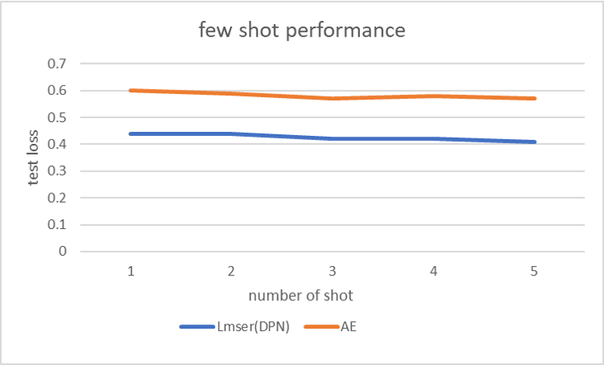

# CS7319_project
This is the project code for CS 7319


## Experiment Result

### 2 reconstruction performance

```
===================== AE ========================
weight analysis start:
weight analysis: fc[0].weight and dec_fc[0].weight:
transpose distance:  10.27124
inverse distance:  6.3389487
weight analysis: fc[1].weight and dec_fc[1].weight:
transpose distance:  2831.982
inverse distance:  4351.746
weight analysis: fc[2].weight and dec_fc[2].weight:
transpose distance:  1.0128667
inverse distance:  0.35673222

=====================Lmser with DPN ==========================
weight analysis start:
weight analysis: fc[0].weight and dec_fc[0].weight:
transpose distance:  0.0007783578
inverse distance:  0.0
weight analysis: fc[1].weight and dec_fc[1].weight:
transpose distance:  0.0009829665
inverse distance:  0.0
weight analysis: fc[2].weight and dec_fc[2].weight:
transpose distance:  4.3793516e-06
inverse distance:  0.0
```

### 3 reconstruction in few-shot learning scenarios
we sample a small train epoch from MNIST/F-MNIST, each epoch contain `num_batch` batches,
 `n_per_batch` samples per batch, `way` class per batch. We create the following classic few-shot learning scenario.

- **5-way, n-shot**: 
 `num_batch=100`, `n_per_batch=n`, `way=5`

 other training parameters
 `epoch=10`
 #### train loss
  |scenarios     | AE   | Lmser(DPN) | Lmser(DCW) |
  | ---          | ---  | -----      | ---- |
  | 5-way 1-shot | 0.60 |    0.44    |      |
  | 5-way 2-shot | 0.59 |    0.44    |      |
  | 5-way 3-shot | 0.58 |   0.42    |      |
  | 5-way 4-shot | 0.58 |   0.43    |      |
  | 5-way 5-shot | 0.57 |    0.41    |      |

 #### test loss
 
 |scenarios     | AE   | Lmser(DPN) | Lmser(DCW) |
 | ---          | ---  | -----      | ---- |
 | 5-way 1-shot | 0.60 |    0.44    |      |
 | 5-way 2-shot | 0.59 |    0.44    |      |
 | 5-way 3-shot | 0.57 |   0.42    |      |
 | 5-way 4-shot | 0.58 |   0.42    |      |
 | 5-way 5-shot | 0.57 |    0.41    |      |



besides training loss, we found that Lmser(with DPN) converges much faster than traditional AutoDecoder